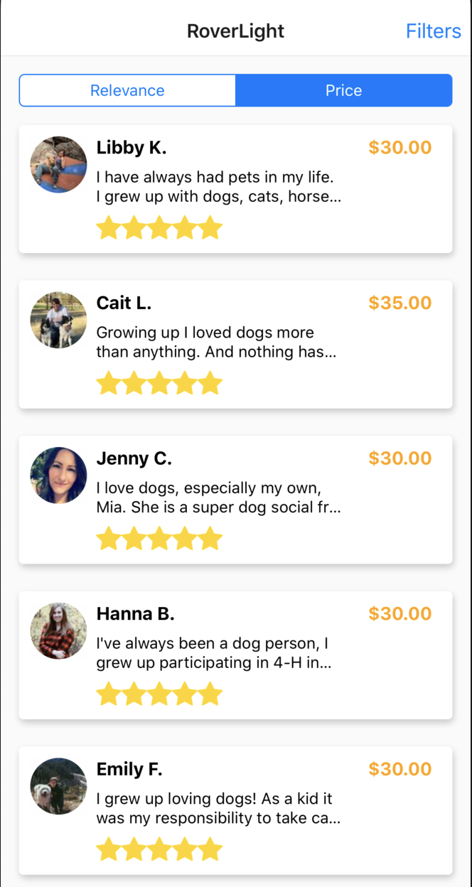
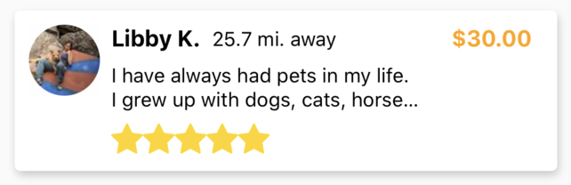

# Rover React Native Interview Project

Rover is building a minimal version of its app and we need your help! We've identified 2 bugs and 2 feature requests that need to be resolved before launching.

## Introduction

The app contained in this repository is a [Expo-created React Native app](https://expo.io/) using the "managed workflow". It is designed to be easy for you to jump in and get started.

In addition to completing the outlined tasks, we ask that you add to this README file notes from your implementations and any thoughts you have on the projects structure or patterns.

Finally, this is not a trick project, so if you have any questions, don't hesitate to ask.

## Setup

To run the project, clone the repo and run `yarn start` or `npm start`. This command will require:

1. You have Node version >=10 installed
2. You have the expo-cli installed globally

For more in formation, take a look at the [Expo documentation](https://docs.expo.io/versions/v36.0.0/get-started/create-a-new-app/#starting-the-development-server).

## Tasks

### 🐞Bugs

#### Sort by price is not working

When trying to sort by price, the results do not change order.

##### Steps to Reproduce

1. Open the app
2. Select the "Price" sort option

##### Actual Result

Order does not change from "relevance" option

##### Expected Result

Order of results changes to be from price low to high

#### Offline searches fail silently

When the app goes offline, searches will fail, but there will be no indication to the user.

##### Steps to Reproduce

1. Open the app and let search load
2. Disconnect from the internet
3. Adjust filters (i.e. from "Dog Boarding" to "House Sitting")
4. Press "Done"

##### Actual Result

Search results are the same as the initial search

##### Expected Result

Error message is shown in place of search results (feel free to improvise the message text and design)

### 📦 Feature Requests

#### Add distance away to search results

We've determined that knowing how far a provider is from the user is an important factor in decision making. We need to add this information to the search results.

This data already exists in the API response.

##### Definition of Done

Each sitter card displays the distance away from the user.

#### Price filter

We need to allow users to filter search results by price. The API support the following query params (more detailed API documentation in [SEARCH.md](./SEARCH.md)):

| Key | Type | Example |
|---|---|---|
| minprice | Number (between 0 and 150) | minprice=10 |
| maxprice | Number (between 0 and 150) | maxprice=130 |

You can use your own knowledge of common UI patterns to decide how these filters will be displayed.

##### Definition of Done

User can filter by price on the "Filters" screen

## Candidate Notes

Add your notes here. Things to consider:

- How did you solve the issues?
- What choices did you make?
- What are your thoughts on the project's structure?
- What might you do differently if you were setting up this project?

## When you're done with the project...

When you're done with the project, push your work back into the repo. Then, reply to the email you received from us letting us know you've pushed your project. You may be tempted to email us directly, but don't do that because we rely on an applicant tracking system (ATS) to keep on top of candidates in process. Replying through it will help ensure you don't slip through the cracks.